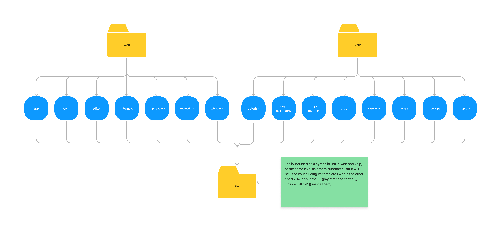

# Lineblocs Helm Chart

This projects contains helm charts needed to deploy Lineblocs services.

## Description

This project provides a Helm chart for deploying Lineblocs services onto a Kubernetes cluster. Helm is a package manager
for Kubernetes that makes it easy to define, install, and manage applications as Helm charts. Charts in this repository
are represented as parent and child charts to maximize re-usability and minimize duplicates. You can find a simple 
diagram showing interactions between the charts at the end of the file.

You will find two main charts : `web` and `voip`. Alongside, you will find standalone charts like `rtpproxy` and other 
folders with useful contents like `database`, `secrets` or `libs`. 

## Table of Contents

- [Compatibility](#compatibility)
- [Installation](#installation)
- [Configuration](#configuration)
- [Required secrets](#required-secrets)

## Compatibility

| K8s version | is compatible |
|-------------|---------------|
| 1.27        | yes           |
| 1.26        | yes           |
| 1.25        | yes           |
| 1.24        | yes           |
| 1.23        | yes           |
| 1.22        | no            |

## Installation

To install the Helm chart, follow these steps:

1. Make sure you have Helm installed on your local machine and have configured it to connect to your Kubernetes cluster.

2. Clone this repository to your local machine.

   ```bash
   git clone https://github.com/Lineblocs/helm-chart.git
   ```

3. Change into the cloned directory.

   ```bash
   cd helm-chart
   ```

4. Go in `web` or `voip` charts folder.

5. Customize the chart's values in the `values.yaml` file according to your requirements.

6. Don't forget to do either a build or an update of Helm dependencies if you haven't already :

   ```bash
   # Will install exactly what is defined in Chart.lock
   helm dependency build
   
   # Will update to the latest version acceptable by version pattern in Chart.yaml and update Chart.lock
   helm dependency update 
   ```

7. Deploy the chart to your Kubernetes cluster using the following Helm command:

   ```bash
   helm install [release_name] . -n [namespace]
   ```

   Replace `[release_name]` with the desired name for your release and namespace with the one you want to deploy to.
   You can also pass specific values to this command with -f. By default, it will use default values (`values.yaml`)
   but you can give any yaml file you want as long as it is valid (see below).

   ```bash
   helm install [release_name] . -n [namespace] -f [valid_yaml_file]
   ```

   If you want to install the chart with a specific release (they are defined in `values-versions.yaml`), please join
   this file with -f option too and in your main values file specify a `release` field under global object. As value,
   put the desired release you want to install. Please note that the `tag` field defined in components values overrides
   releases tags.

For more detailed instructions on installing and managing Helm charts, please refer to
the [Helm documentation](https://helm.sh/docs/).

PS: you will find some other useful resources in `infrastructure`, `secrets` and `database` folders.

## Configuration

Web and voip charts are top level entity which contains subcharts of each service deployed. In the `charts` folder of
web
and voip, there are all the services deployed. Each one uses `libs` charts (located at the root of this project) as
base.

Here is the content of web chart folder :

```
├── Chart.lock # contains precise information about what version of dependencies have been used
├── charts # contains every subcharts
│ ├── app
│ │ ├── Chart.yaml
│ │ ├── .helmignore
│ │ └── templates
│ │     └── include.yaml # include defined template in libs
│ ├── com
│ │ ├── Chart.yaml
│ │ ├── .helmignore
│ │ └── templates
│ │     └── include.yaml
│ ├── editor
│ │ ├── Chart.yaml
│ │ ├── .helmignore
│ │ └── templates
│ │     └── include.yaml
│ ├── internals
│ │ ├── Chart.yaml
│ │ ├── .helmignore
│ │ └── templates
│ │     └── include.yaml
│ ├── libs -> ../../libs # simlink to libs chart
│ ├── phpmyadmin
│ │ ├── Chart.yaml
│ │ ├── .helmignore
│ │ └── templates
│ │     └── include.yaml
│ ├── routeeditor
│ │ ├── Chart.yaml
│ │ ├── .helmignore
│ │ └── templates
│ │     └── include.yaml
│ └── tsbindings
│     ├── Chart.yaml
│     ├── .helmignore
│     └── templates
│         └── include.yaml
├── Chart.yaml # generic information about this chart and dependencies
├── .helmignore
├── templates
│ ├── _helpers.tpl # some defined templates to help 
│ ├── ingress-demo.yaml
│ ├── init-db-configmap.yaml
│ └── NOTES.txt # displayed information when installing the chart
├── values-versions.yaml # contains releases which can be then installed later 
└── values.yaml # default values
```

Here is an example for com service in web chart:

```yaml
  containers:
    - name: site
      image: lineblocs/site:master
      imagePullPolicy: Always
      ports:
        - containerPort: 8080
      livenessProbe:
        httpGet:
          path: /healthz
          port: 8080
          httpHeaders:
            - name: X-Healthz
              value: health
        initialDelaySeconds: 3
        periodSeconds: 3
      resources:
        requests:
          cpu: "64m"
          memory: "32Mi"
        limits:
          cpu: "4096m"
          memory: "16384Mi"
  domain: com.
  envs:
    secrets:
      - db-secret
    configs:
      DEPLOYMENT_DOMAIN: lineblocs-test.com
      DB_OPENSIPS_DATABASE: CONFIGURED_OPENSIPS_DATABASE
  service:
    ports:
      - port: 80
        targetPort: 8080
```

In web chart, you would write :

```yaml
com:
# config written above
```

For more detailed information on the available configuration options, please refer to the `values.yaml` file inside
web and voip charts.

If you need to declare variation for a specific cloud provider, you can create a new values file (`values-gcp.yaml` for
example).
It will inherit `values.yaml` so you will be able to only override what you want.

### Releases

In the `values-versions.yaml` file, you will find informations about each releases :

```yaml
global:
  releases:
    stable:
      app: master
      com: ...
```

In your desired values file containing all the rest, add a `release` field under global :

```yaml
global:
  release: stable

app:
...
```

`release` field is the chosen release for this installation of the chart (each values can be overriden in each
component afterward). `releases` object contains each release and versions of some or all components.

### Adding a new service

If you wish to add a new service to one of the charts, you can go in the `charts` folder and create a new subchart.
Normally, you can copy another subchart like `app` or `com` for `web` chart and modify chart name in `Chart.yaml`.
Then, reference it in `values.yaml`, like the others, so it has default values!

You can also reference your new component in the `values-versions.yaml` file too.

PS: don't forget to reference your new service in the main `Chart.yaml` (of voip or web) in the field `dependencies` to
keep things clean.

## Required secrets

You will need to add secrets yourself in order for everything to work. They are not managed by this repo for obvious
security reasons.

In order to create a secret, you can use :

```bash
kubectl create secret generic [name_of_secret] --from-literal VARIABLE=[value] --from-file VARIABLE=[path_to_file_with_value] -n [namespace]
```

Here is a list of the ones you will need to create :

### voip:

- ami-secret
    - AMI_HOST, AMI_PORT, AMI_USERNAME, AMI_PASSWORD
- ari-secret
    - ARI_HOST, ARI_PORT, ARI_USERNAME, ARI_PASSWORD
- aws-secret
    - AWS_ACCESS_KEY_ID, AWS_SECRET_ACCESS_KEY
- db-secret
    - DB_USER, DB_PASS, DB_NAME, DB_HOST
- lineblocs-secret
    - LINEBLOCS_KEY

### web

- db-secret
    - DB_USER, DB_PASS, DB_NAME, DB_HOST, DB_OPENSIPS, DB_HOMER
- etcd-secret
    - ETCD_ENDPOINT, ETCD_USERNAME, ETCD_PASSWORD

For more details about Kubernetes secrets, please refer
to [this documentation](https://kubernetes.io/fr/docs/concepts/configuration/secret/).


## Appendix

